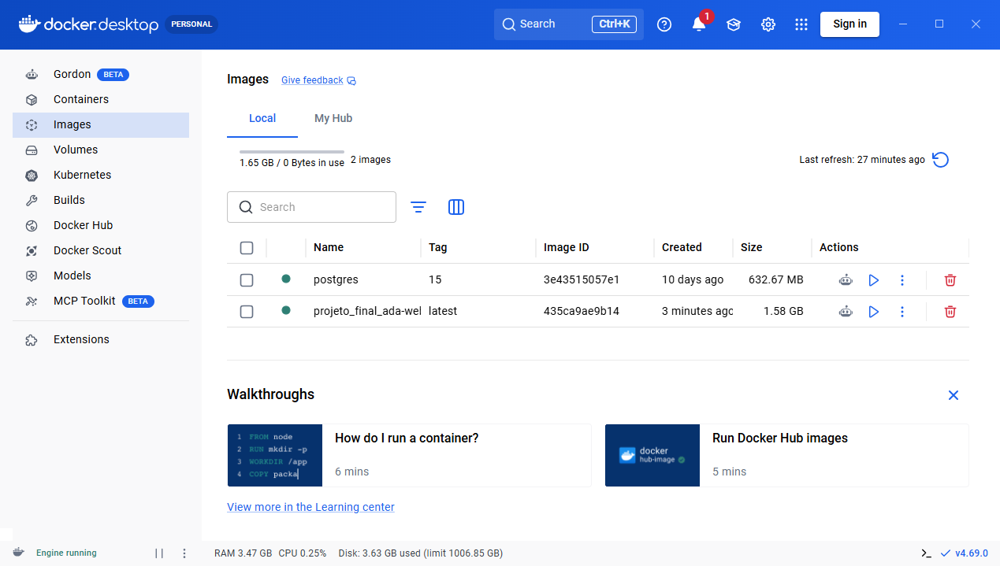
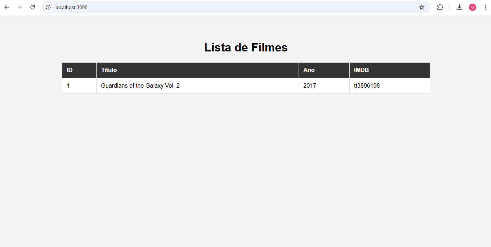
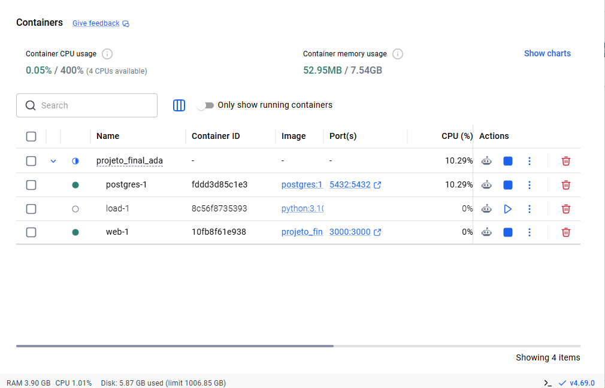
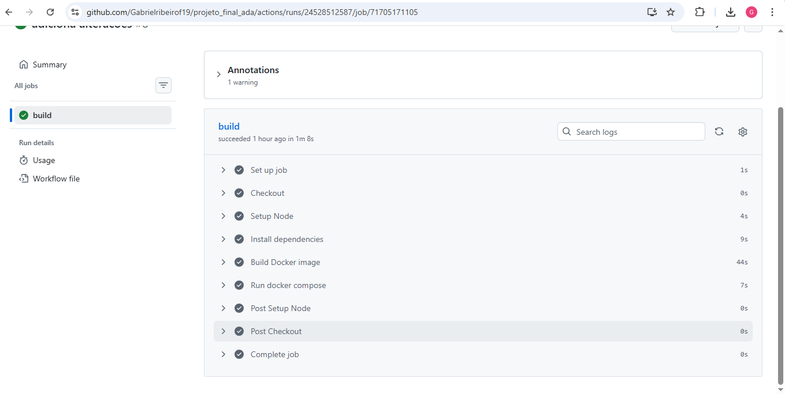
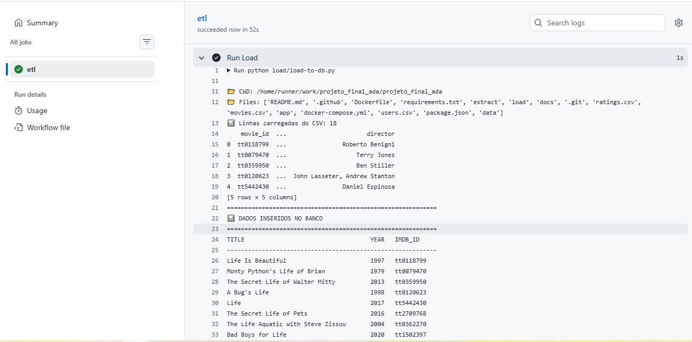

## 📸 Demonstração da Aplicação

Esta seção apresenta capturas de tela da aplicação em funcionamento, mostrando o fluxo principal do sistema.

As imagens criadas com sucesso atraves do docker desktop:

  

---

## 🖥️ Aplicação Web

Tela inicial da aplicação para cadastro e avaliação de filmes.

  

Nesta tela o usuário pode visualizar os filmes cadastrados e suas respectivas avaliações.

---

---

## 🐳 Containers em execução

A aplicação é executada utilizando containers com Docker.

  

Os serviços são orquestrados utilizando **Docker Compose**, contendo:

* Aplicação Web
* Banco de dados PostgreSQL

---

## ⚙️ Pipeline CI/CD

O projeto possui uma pipeline automática utilizando GitHub Actions.

  

A pipeline executa automaticamente quando ocorre um **push no repositório**, realizando:

* checkout do código
* instalação das dependências
* build da imagem Docker
* execução da aplicação

---

## PIPELINE DE ETL RODANDO

O projeto possui uma pipeline automática utilizando GitHub Actions.

  

### link dos artefacts gerados:
https://github.com/Gabrielribeirof19/projeto_final_ada/actions/runs/24532952034/artifacts/6483215750

### Image do docker Hub
https://hub.docker.com/repository/docker/gabriel461/filmes-app

### CD Funcionando

